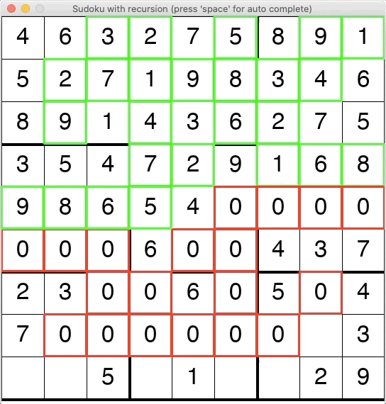

# Sudoku_recursion_withGUI

Sudoku solver using recursion. Can be solved by user in the pygame GUI, where the program allows you to lock in your guess if it is correct, otherwise you get a 'strike'. Your guess is input temporarily, and if you confirm the guess with 'enter' then the program checks if it is a solution. By pressing 'space' the program auto-solves the sudoku and gives you the full solution. This is visualized, and a snippet of one auto-solution is shown in the GIF below:

Requirements: python3 and pygame
